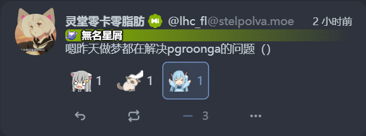

---
# https://vitepress.dev/reference/default-theme-home-page
layout: doc
---

# Sharkey/Misskey 食用指南


<center><small>Misskey系的美丽界面</small></center>

> 欢迎来到 Mastodon 以外的世界！
## Why Not Mastodon?

> **Mastodon简介**
> Mastodon 不同于微博或 Twitter，是一个开源的去中心化社交网络。去中心化设计防止社交数据被利益集团垄断，也增加了屏蔽审查的难度。整个长毛象网络由上千个实例组成，这些实例相互连接，最终形成了一个庞大的网络，就像是一个巨大宇宙。每一个服务器都是宇宙中的一个星系，用户就是每个星系里的行星。你可以随时导出自己的账户并转移到其他实例中，无需担心因为实例运营者的问题导致的数据丢失。

如果你不知道 Mastodon 是什么，那你可以看看上文。如果你已经知道了 Mastodon 是什么，请你还是看上文，并把 Mastodon 换成 “联邦宇宙”。

这是写下本文时来自 [FediDB](https://fedidb.org/) 的数据：


事实上，Mastodon 只是联邦宇宙的一部分。但是，由于它占领了联邦宇宙的半壁江山，Mastodon 获得了事实上的垄断地位。

这并不是一件好事。尤其是，Mastodon实际上是联邦宇宙软件中最保守的一批。截止到本文写作时，它既不支持表情回应（Reactions），也不支持引用嘟文（Quote），也不支持带格式文本，管理员没有设置项配置字数限制。Mastodon 用户“享受”的是联邦宇宙中最死板的那一部分体验。但是，由于 Mastodon 实在是太出名了，即使 Mastodon 的体验是最死板的，所有人仍然会优先介绍 Mastodon。这更是导致一些人被推荐使用Mastodon后感到，“什么开源破车，不好用，不用了”，对整个联邦宇宙的印象不佳。

本项目希望介绍 Misskey 系的方方面面，来增加这个好用的联邦宇宙软件的知名度。

## Misskey 初见食用指南

> [!INFO] 这些都是Misskey！
> Misskey 有很多分支，比如 Sharkey，Firefish，Iceshrimp，Catodon…… 这是因为原生 Misskey 的开发语言是日语，并且开发者主要考虑的也是日本用户。因此，来自世界各地的人纷纷对 Misskey 进行 Fork 以满足更多多文化的需求。

### 联邦宇宙的工作原理！

和 Mastodon 一样，Misskey 是联邦宇宙的一员。这是与传统社交平台截然不同的一种方式。

传统的社交平台是中心化的、垄断式的。如果你用的是 QQ，你就不能和用微信的朋友聊天，除非你也注册一个微信号；如果你的朋友在用微博，你没法从Twitter上给它回复，除非你也去注册微博。

而联邦宇宙的结构与它截然不同。在联邦宇宙，无论是Misskey还是Mastodon，每个实例就像宇宙中的一颗星球。星球间彼此连接，在同一个星球上你们可以无障碍的互相沟通，在不同星球上你们还是可以。


<center><small>从Misskey发布的帖子，在Mastodon中同样会显示</small></center>


### 选择一个 Misskey 服务器注册

> [!INFO]
> 服务器不是人数越多越好！

 这是一个非常常见的误区，在Mastodon中甚至同样常见。联邦宇宙的服务器是彼此互相联通的，因此无论你选择大站还是小站，都能与同样的朋友们交流。
 
 与此同时，大站反而更有风险：巨大的实例（超过10万人）很可能有审核问题，由于人数过多，管理员无法快速审核仇恨内容。巨大的实例还很可能有连接问题，这是联邦宇宙的机制导致的，每一个实例都彼此沟通，但受限于沟通的桥梁（网络带宽）巨型实例可能会偶尔发生堵塞，导致你的朋友无法及时看到你的帖子。
 
 笔者最推荐的是100人以上，2000人以下的站点。这样的站点人数足够多，一般不会突然消失，同时也足够少，容易让管理员有精力维持一个较为和谐的气氛。

Misskey 注册不需要手机号这样的信息。一般来说，Misskey系服务器会要求你提供一个邮箱，和一个**全服必须唯一的，由字母和数字构成的用户名**。有的服务器可能还需要你提供一个注册理由以供管理员审核。

> [!WARNING]
> 用户名一旦注册后就再也不能更改了，并且即使你之后删除账号，也会一直占着那个”坑位“，以后你再也不能以这个用户名注册！

#### 用户全名

这是一个联邦宇宙的知识。如果你在 `example.com` 这个站点注册了一个用户名为 `miao` 的用户，那么 `@miao@example.com` 就是你的用户全名 —— 和邮箱很像！但是前面多一个 `@`

用户全名关系着跨站 `@` 人和搜索人的能力。就像邮件里，你给别人发邮件可能要发送到 `someone@outlook.com` ，后面的 `@outlook.com` 必不可少，联邦宇宙里，如果你要找一个人，后面的 `@` 实例名也是必不可少的！

通过用户全名，你也就能跨站点和人联系了。

### 发帖

注册成功并进入Misskey后，可能会有很多眼花缭乱的功能。但我们可以暂时不关心这些，先来看看最重要的：如何发帖

一个典型的发帖框大约长这样：


如果要插入图片，可以点下方按钮里面最左边的  按钮。

如果要插入投票，可以点  按钮

接下来介绍联邦宇宙非常常用的 **内容警告 (Content Warning, CW)** 功能：

> 想象一下，你正在愉快的刷着推特，突然间，一篇关于你正在追的动漫/漫画/游戏/小说的剧透讨论出现在你的时间线上
> 这分为两种可能：如果你已经看完了，你可能会愉快的加入到讨论中
> 如果你还没看完，却被这篇帖子剧透了一脸，你的心情很可能就没这么美丽了。

这就是为什么**内容警告**如此重要。它提供一个功能，为你的帖子写一个标题或者概括，然后让别人先看到概括，再选择要不要点开看看。

内容警告也适用于更多的场合，比如负能量的发泄，既想说出来又害怕影响他人心情；比如长文的书写，不希望几千字的长文在别人的时间线上占太多地方；又比如想分享争议性的话题、想分享色色的图片、或者上半部分写问题下半部分写答案，都是内容警告的用武之地。

要使用内容警告，按 按钮。接下来，发帖框会被分为上下两部分，上半部分你可以写警告内容，而下半部分会被折叠在一个”查看更多“的按钮里，只有点击后才会显示。


Misskey 的发帖支持类似 Markdown 的 MFM 标记，关于 MFM 标记的部分我们之后再说，不过这里可以看看最基本的记号方式：

```
文字两边加两个英文星号会**加粗**
文字两边加两个英文波浪线会~~划掉~~
文字两边加small tag会<small>变小</small>
```

你还可以在发帖框里 @ 人，记住，想要 @ 一个别的站的用户的时候，必须用全名比如 `@lhcfl@nya.one` ，但是如果你想要 @ 的是本地站的用户，后面的 @ + 站点地址可以不写。

因为记号和最后呈现出来的样子不太一样，笔者很推荐点右下角的眼睛图标打开预览页面


Misskey非常适合喜欢一个小纸堆来分享自己的情绪，又不想让太多的人看到的人。光帖子的可见性就有四个等级，用户右上角的地球图标点击后可以选择帖子可见性范围：

- **公开**：完全公开，你的帖子可以在各个时间线上被看到，并且（如果允许被索引）可以被搜索到。
- **首页**：这个翻译很有问题，它在Mastodon里叫作unlisted，在Firefish里面被形象的翻译为悄悄公开。它有点复杂，是这样的：
	- 不会出现在除了”首页“或者”社交“以外的任何时间线上，但任何人点进账号主页，或者有你帖子的链接就可以看到
	- 关注你的人可以在”首页“或者”社交“时间线上看到你的悄悄公开帖子
	- 部分软件，比如 Firefish ，还会让你的悄悄公开帖子不会被搜索到，除非你自己。
- **仅关注者**：只有关注你的人能在时间线或者账号主页上看到，别人就算有链接也不行
- **指定用户**：也就是私信，但是可以选择好几个人。不选择其他用户的话，就是仅自己可见。

> [!Warning]
> ”指定用户“（私信）并不是端到端加密存储的，从理论上而言，你和你私信的人的服务器的管理员都可以通过直接查询数据库看到你的**任何**帖子。**不要在私信中分享银行卡、密码这样的机密信息！**
> 但是，就绝大多数情况而言，如果你和你私聊的人的站长不是一个超级大变态，是不会有人专门跑到服务器上写SQL脚本看你的私信帖子的。所以——请挑个人品好的站长 (づ￣ 3￣)づ


### 刷时间线


时间线选择器显示在Misskey界面的顶部。一般而言，Misskey 提供了至少 4 个时间线。我们依次介绍

#### 首页

只显示你和你关注的人的帖子。

因此，如果你刚刚注册Misskey，还没有关注任何人，首页会是空空荡荡的，这时候推荐你去看看社交时间线。

#### 本地

本站用户发布的**公开**帖子。

在本地轴上只能看到公开帖子，哪怕是你自己发布的“首页”帖子或者“仅关注者”帖子，也是看不到的。

#### 社交

社交时间线 = 首页时间线 + 本地时间线

既能看到你和你关注的人的帖子，又能看到本站用户发的公开帖子！

如果你所在的站点，本站内容很讨你喜欢——完全可以多刷社交时间线 :D

#### 全局

全局时间线是所有和你的站点联邦的用户发布的**公开**帖子

同样的，哪怕是你自己发布的“首页”帖子或者“仅关注者”帖子，也是看不到的。

#### 推荐/Bubble

推荐时间线，有时也会被叫作Bubble时间线。这个时间线需要管理员手动打开，它是筛选到只包含管理员选择的实例后的全局时间线。

#### 列表

你可以选择把你的一个列表固定到你的时间线上。

### 与人交互

时间线上你可以看到用户的帖子。一般而言，Misskey的Fork们分为两种帖子呈现方式：Misskey原生风格与Firefish风格

#### Misskey原生风格


Misskey原生风格下面只有4个按钮，分别是回复，转发，回应和更多。

- 回复：字面意思。

- 转发：像推特一样，点转发后会冒出一个菜单，你可以选择是直接转发，还是像上面一样引用（也就是带评转发）。再点一下可以取消转发，也可以按右上角的三点来取消转发


- 回应：你可以给一个帖子点表情！点的表情支持实例支持的任何表情。唯一的问题是，Mastodon收不到回应，所有表情回应在Mastodon那里只会被视为点了一个星星🌟

> 这是 Mastodon 的问题不是 Misskey 的问题。Misskey, Firefish, Iceshrimp, Pleroma, Fedibird, Friendica, Akkoma... 这些全都支持表情回应。~~所有风云人物都会出席，但你猜，谁收不到邀请，是你！Mastodon~~ Mastodon：我孤立所有人



- 更多：一些不那么常用的功能被折叠在里面，比如复制链接，比如编辑，删除，收藏，置顶，翻译，屏蔽等等

> [!Note]
> 超级常见的问题——Misskey如何从时间线上点进帖子的页面看别人的回复？
>
> 这真的是Misskey的设计失误了，你必须点击右上角的时间戳（比如上面的最近、2小时前）然后才会发现这居然是个链接！这个链接点进去就是帖子页面了。
> 
> 这个设计失误在 Firefish 风格的帖子上得到了修复。
#### Firefish风格

Firefish 风格是 Misskey 的几个英文用户友好的分支使用的帖子风格，代表性的有 Firefish 和 Sharkey


Firefish风格的帖子和Misskey风格的帖子功能几乎一样，只是把一些按钮分出来了：

下面的六个按钮分别是：

- 回复：还是字面意思
- 转发：和Misskey风格的转发一样，只是图标变成了小火箭🚀
	- Firefish 风格的转发允许你转发的时候选择可见性。如果看到了只想转给亲友看到的帖子？不妨试试 转发（仅关注者）
	- 
	- 虽然大多数情况而言，直接选最上面那个就好
- 星星🌟或心心♥️：选择困难症？这里有一个便捷的按钮可以一键点心♥️或者星🌟作为回应
- 表情回应：和Misskey风格的一样，只是图标变成了smile~
- ~~99~~引用：好像很多人会把这个看成99，但是实际上它是 `”` ，意思是引用。
- 更多：和Misskey一样

### 侧边栏


侧边栏是可以自定义的！如果下面介绍的项目里面没有的话，那就是被放在了“更多”里。你可以在设置 - 导航栏 中自定义侧边栏的显示顺序，和哪些项目会被放在“更多”里。

- **时间线**：时间线页面
- **通知**：通知页
- **便签**：便签是 Misskey 系一个有趣的功能，类似于“帖子文件夹”。你可以把帖子放进不同的便签里，分门别类进行管理。而相对而言，收藏就是“更普通的收藏夹”，没法对帖子进行分类。
 
- **收藏**：字面意思，收藏夹
- **网盘**：是的，Misskey系自带一个网盘！
	- 你发的每一个帖子里上传的每一个图片，亦或是的头像，banner，这些全都会出现在你的网盘中
	- ⚠️ 记得千万别乱删你的网盘！删除网盘里的图片，图片关联的帖子/头像也就显示不出图了
	- 但是，网盘不只是能上传图片……如果你所在的站点给你分配的网盘空间足够，你可以传你想要的任何文件上去！
	- 网盘还能建文件夹，里面的文件链接拿出来还能当图床；总之，网盘就是你能分享你的文件的地方。
	 
	
- **发现**：怎么说呢，其实没什么用；发现页内能看热门的本地帖子，但是这个算法聊胜于无，所以其实没什么用
- **公告**：服务器管理员写的公告，记得看哦！
- **搜索**：用来搜索帖子或者用户的地方！
	- 不同于 Mastodon，Misskey默认支持全文搜索。Misskey的搜索功能能搜到大家发布的你的关键词的帖子，而不是像Mastodon那样，只能搜到自己交互过的
- **关注申请**：如果你选择了锁嘟（关注请求需要批准），别人尝试关注你的话，就会在这里显示关注申请。你可以批准或者拒绝
- **成就**：（仅限Misskey 13及以上）你获取的一些好玩的成就，比如发帖达到 X 篇？或者——连续登录 X 天？
- **查询**：查询并跳转到 ActivityPub 支持的链接，比如 Mastodon 的嘟文或者 `@xxx@example.com` 这样的用户名
- **列表**：和 Mastodon 一样，你可以把一组用户加入到列表，看她们发的帖子
- **天线**：天线是Misskey系的独有功能，用来筛选**天线创建以后**符合条件的帖子。
- **页面**：可以用来发博客或者长文的地方，**不和其他站点联通**
- **Play**：站友或者你用 AiScript 写的小游戏 or etc。需要你会编程才懂怎么编写Play
- **图库**：**不互联** 可以发图片的地方
- **频道**：**不互联** 类似于站内小论坛，问题是不互联所以没什么用
- **Games**：Misskey自带的小游戏
- **切换界面**：为熟悉 Misskey 的用户提供切换界面的功能！
	- 默认/经典：预设的比较好看的样式
	- Deck：可以自己定义的多列界面
- **关于**：显示关于菜单
- **重新加载**：字面意思，用来给 iOS 的 PWA 等没有刷新按钮的东西提供一个刷新按钮
- **清除缓存**：清除本地缓存。如果一些图片或者emoji加载不出来可以试试
- **个人资料**：字面意思
- **控制面板**：（仅限管理员）服务器设置
- **设置**：你自己的用户设置

## 实用设置！

这些不算是“初见”就会的了，不过还是摆在这里

### 隐私设置

#### 锁嘟

在设置 - 隐私 中打开“关注请求需要批准”，别人就不能随意关注你了！你需要手动批准她们的关注请求。

和推特的锁推不一样，推特锁推以后，不关注你就没法看到你的**任何**帖子；而Misskey和Mastodon，锁嘟以后别人还是能看到你的公开帖子。

这样，兼顾了发言的欲望与隐私的追求，很棒吧

### 推荐的设置

#### 表情符号选择器

因为Misskey的默认表情符号选择器真的很小，因此在设置 - 表情符号选择器中，很建议你把选择器显示设置的每一项都开到最大，方便选择表情


### 折叠转发（与回复）

设置-常规设置-显示帖子中


推荐打开 “省略已经看过的转发内容” 防止转发内容刷屏
（仅限Sharkey）推荐打开 “自动折叠被回复帖子” 防止被回复内容争抢注意力

#### 使用系统默认字体（Misskey）

> Firefish，Sharkey 等都对这里做了优化，因此可以不用默认字体

Misskey是日本人设计的，因此默认的字体更适合日语用户阅读。原版 Misskey 默认的字体英文狭窄又难看，同时部分中文会用日文字体显示。这对于中文用户而言可能挺伤眼睛的

建议在 “设置 - 常规设置 - 外观” 下找到 “使用系统默认字体” 并打开

#### 与服务器连接中断时……

由于网络波动，可能你在愉快刷 Misskey 的时候，突然连接中断了。这会导致你停留在页面上的时候收不到新的帖子或者缺帖子，只有刷新后才能看到。

建议在 “设置 - 常规设置 - 行为”中设置“与服务器连接中断时” 为 “安静警告”


### 好玩的设置

#### 猫猫模式

在设置 - 个人资料 - 高级设置中有一个喵！！！！！！！！！
打开后你的头像上就会出现猫耳朵，并且说话会喵化（na -> nya）


猫模式和其他Misskey互联。


## 附录： 常见 Misskey Forks 和常见联邦软件之间的功能比较

> 这些比较均使用同一个大版本内的最新版本

用户功能：

| 功能               | Misskey 原生 v13 | Sharkey（基于Misskey v13） | Firefish 或 Iceshrimp（基于Misskey 12) | Mastodon           | Pleroma |
| ---------------- | -------------- | ---------------------- | ---------------------------------- | ------------------ | ------- |
| 编辑帖子             | ❌              | ✅                      | ✅                                  | v4✅, v3❌           | ✅       |
| 字数限制             | 3000           | 默认3000，最大100000，管理员可调  | 默认3000，最大100000，管理员可调              | 原版500，Glitch版管理员可调 | 管理员可调   |
| 附图限制             | 16             | 16                     | 16                                 | 4                  | 16，可调   |
| 引用嘟文             | ✅              | ✅                      | ✅                                  | ❌                  | ✅       |
| 表情回应             | ✅              | ✅                      | ✅                                  | ❌                  | ✅       |
| 富文本              | ✅              | ✅                      | ✅                                  | ❌（Glitch✅）         | ✅       |
| 仅本地模式            | ✅              | ✅                      | ✅                                  | ❌                  | ✅       |
| 全文搜索             | ✅              | ✅                      | ✅                                  | 默认❌                | ✅       |
| 内置聊天             | ❌              | ❌                      | ✅                                  | ❌                  | ✅       |
| 关注Hashtag        | ⭕可通过“天线”间接实现   | ⭕可通过“天线”间接实现           | ⭕可通过“天线”间接实现                       | ✅                  |         |
| 导入帖子             | ❌              | ✅                      | ✅                                  | ❌                  | ❌       |
| 自制主题             | ✅              | ✅                      | ✅                                  | ❌                  | ✅       |
| Mastodon API 兼容性 | ❌（完全没有）        | ⭕（聊胜于无）                | ✅                                  | ✅                  | ✅       |
| 网盘               | ✅              | ✅                      | ✅                                  | ❌                  | ❌       |
| 趣味功能（头像挂件，成就……）  | ✅              | ✅                      | ❌                                  | ❌                  | ❌       |
| 回复串呈现            | ⭕（视觉效果不好）      | ✅                      | ✅                                  | ❌                  | ✅       |


管理员功能：

| 功能          | Misskey 原生 v13 | Sharkey（基于Misskey v13） | Firefish 或 Iceshrimp（基于Misskey 12) | Mastodon | Pleroma |
| ----------- | -------------- | ---------------------- | ---------------------------------- | -------- | ------- |
| 一般审核能力      | ✅              | ✅                      | ✅                                  | ✅        | ✅       |
| 可以不用邮箱注册    | ✅              | ✅                      | ✅                                  | ❌        | ✅       |
| 注册填写理由      | ❌              | ✅                      | ❌                                  | ✅        | ✅       |
| 原子化用户权限控制   | ✅              | ✅                      | ❌                                  | ❌        | ✅       |
| 用户可以添加emoji | ✅              | ✅                      | ✅                                  | ❌        | ✅       |


## 版权与致谢

本文采用 CC-BY-NC-SA 4.0 发布

**参考**
- https://akaito.xyz/post/misskey/

